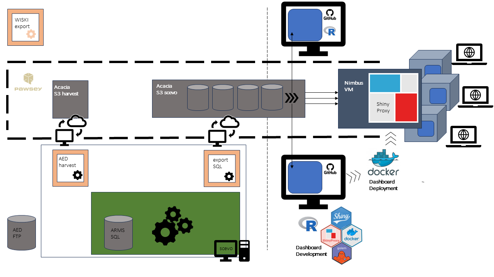
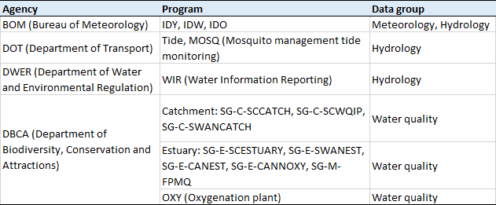
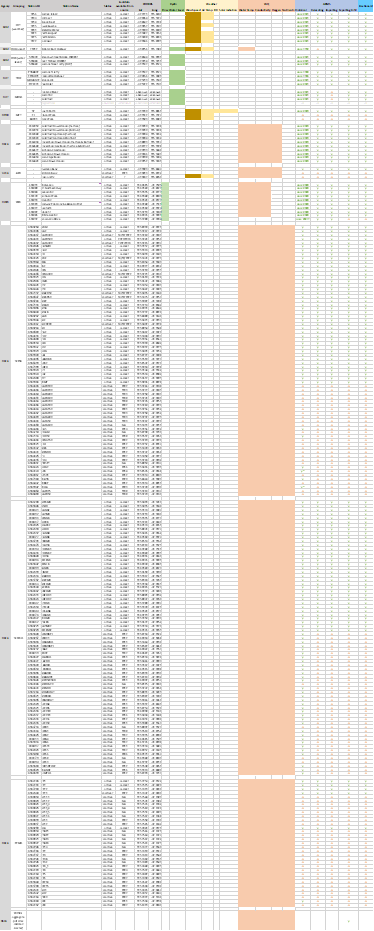
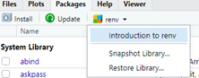
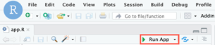
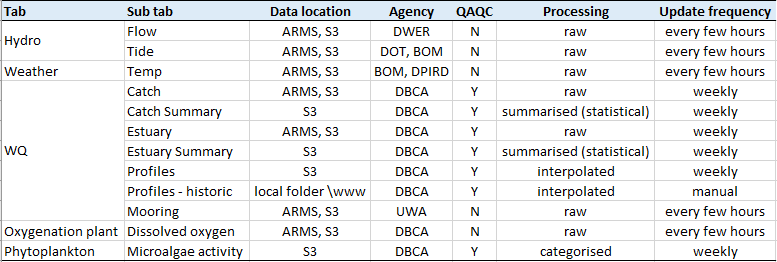
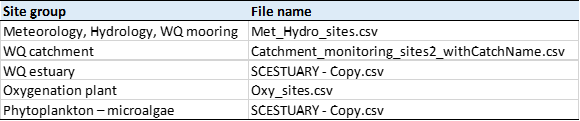
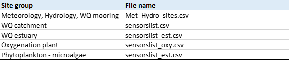

# sce_dashboard
Shiny data dashboard for displaying environmental data from the Swan-Canning Estuary

 

## Dashboard/ARMS/S3 ecosystem

 

## Data sources and harvesting
Data included in the system are sourced from various agencies and programs, which are summarised in Table 1. Details for monitoring stations and status are listed in Table 2.

Table 1. Summary of data sources included in the SCEVO system.
 

 

Table 2. Summary of monitoring stations, data type and status in the SCEVO system.
 

 

 

## Building/editing the dashboard

### Accessing and running the dashboard
The sce_dashboard repository can be cloned via GitHub using GitHub Desktop or downloaded as a zip file. Once cloned and placed into your working directory, go to folder dashboard_Vx and double click the R project file scevo.Rproj. Note the dashboard was developed in R 4.1.0 and has not been tested in earlier versions.
Once opened, run renv::restore() in the console or navigate to the Packages pane and click renv – Restore Library in R studio. This will ensure all the packages and dependencies (in the same versions as used in dashboard development) required by the dashboard are installed into the project library and contained within the project environment, which will not affect your existing R library.
 

 
Once the R project environment is restored (i.e., packages installed), to start the dashboard app, open app.R (located in the main working directory) and either run the code in the console or click Run App on the top right corner of the R script pane in R studio. Depending on internet connection, it may take several minutes up to ~20 minutes to start the app. 
 

 

After the app is loaded properly, navigate to tabs and plot data as needed. Some plotting may take longer to process depending on the amount of data and calculation involved, as well as internet connection. Plots that usually required longer processing times are: 
- Hydrology – Tide (due to data being high-frequency) 
- Water quality – Catchment Summary and Estuary Summary (due to calculations), may take up to 1 min
- Water quality – Profiles (due to calculations), may take about 1 min

 

### Basic configuration
Basic configurations of the dashboard are set in inst\golem-config.yml, including
- database_connection (logical): controls whether the dashboard reads data from the ARMS database (true) or Pawsey S3 (false) if data are stored on both locations (refer to Table 2). Note at present, ARMS database is only accessible when user is connected to UWA internal network. Therefore, for external users this should be set to false.
- wiski_connection (logical): controls whether the dashboard reads the aggregated DBCA water quality data (refer to Data sources and harvesting) from Pawsey S3 (true) or local folder www\ (false). This should be set to true as data on Pawsey S3 are most up to date, while false can be used when Pawsey S3 is offline due to unforeseen circumstances and user needs access to historical data.
- database host information: sets host information for accessing ARMS database.
- mod_xxx (logical): turns on/off individual modules (e.g. weather, hydro).

Table 3. Dashboard data summary by tab.
 

 

### Basic editing
Dashboard contents that may require routine updates can be edited as below
- update home page slideshow images: simply replace images in www\Images\. Compatible image format includes .png and .jpg. Note all images should be in the same size (width and height) for correct display.
- update “About” text: this can be edited in their corresponding sections in app_server.R. For example, to edit ‘About’ for WQ tab, go to section ##### WQ - ABOUT #### and replace text within “xxx”. 
- update monitoring site names/ID/agency/coordinates for mapping and site names appearing in ‘Select Site’ dropdown menu: edit corresponding csv file in www\ as listed in Table 4. Site names here only controls what appears in the dashboard and do not need to match database naming convention.
 
Table 4. 

 

- update variables in dropdown menu ‘Select Variable’: edit corresponding csv file in www\ as listed in Table 5. Variable names here only controls what appears in the dashboard dropdown menu and plot label/legend and do not need to match database naming convention. However, they must match site names in files listed in Table 4. The sensor_repository_xxxxx are the unique IDs used to fetch data from ARMS or Pawsey S3 so please ensure the ID exists in database before adding to the dashboard otherwise dashboard may crash if prompted to fetch an invalid ID.
 
Table 5. 

 

### Advanced editing
Advanced editing of the application server logic, functions, user interface (UI) may be completed by an experienced R user. An overview of the app structure is provided below as a guide:
The R\ folder contains all codes. The two main scripts are 
- app_ui.R: controls the front end of the dashboard, including tab structures and panel components.
- app_server.R: sets out the overall server logic and what ‘goes behind the scenes’, such as data input/output and reactive components of the app. This is organised into sections corresponding to each tab.
 
Script names that start with fct_ are customised functions called by the two main scripts above. Script names with ‘UI’ in it controls the UI component for a particular tab and are called by app_ui.R. For example, fct_mooringtimeseriesUI.R sets the content and appearance of dropdown menus and plot window for the WQ mooring tab. Script names that start with fct_plot* are plotting functions and may contain relevant data processing code. fct_sensorMapMarkers*.R are functions to add map markers on blank leaflet maps for relevant data groups.
Functions associated with fetching data from ARMS or Pawsey S3 are in fct_databaseConnect.R (ARMS) and fct_awss3*.R (Pawsey). 
Code in these scripts may be integrated with the main configuration file in inst\golem-config.yml. However, since the app loads data, scripts and functions in a particular order when starting, the configuration component may not function properly at certain places in the code.
The data\ folder stores .rda files that are directly available to the app. The sensorslist*.rda files contain all sensor code IDs for each site and variable. These files are prepared automatically when the app is run, from the csv files listed in Table 4 and processed by R\Fullcleaned_sensorlist.R. The rivRmon_sysdata.rda is a static file extracted from the rivRmon R package developed by DBCA, which contains bathymetric information for profile plots. 

## Deploying the dashboard
- Instructions on how to build package
- Instructions on how to build docker image of dash
- Instructions on how to access VM
- Instructions on adding to Shiny Proxy 

## Known issues
- 'Elevation' layer on Water Quality map missing due to size limitation
- Profile plot (static image) on 'Profiles - historic' tab gets cropped on smaller computer screens